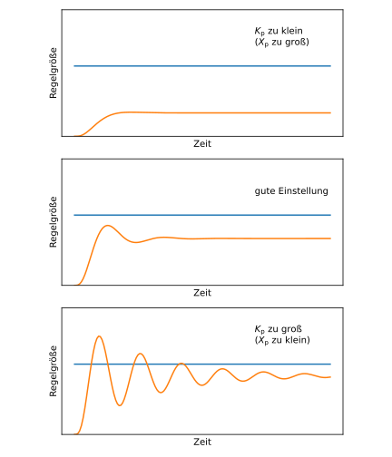
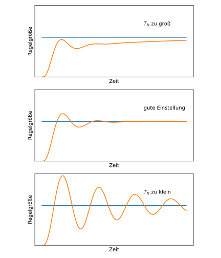
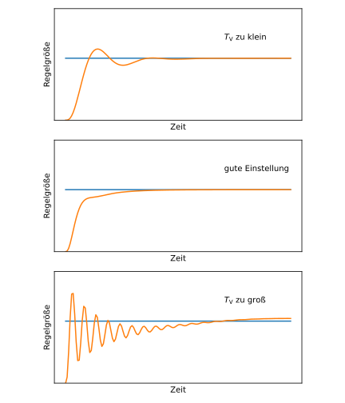

# Steuerung und Regelung
Beim **Steuern** und **Regeln** handelt es sicht um grundlegende Vorgaenge der Automatisierungstechnik, die Maschienen und Prozesse lenken.\
Der entscheidenede Unterschied ist ob es eine stetig Rueckmeldung uber das Ergebnis erfolgt.

---

---

## Steuerung vs. Regelung: Grundlegende Unterschiede
| Kriterium | Steuerung | Regelung |
| --- | --- | --- |
| Prinzip | Offen (kein Rückkopplungspfad). | Geschlossen (Rückkopplung über Sensoren). |
| Ziel | Systemverhalten vorab analysiert → Steuersignale basieren auf Modell. | Kontinuierliche Anpassung der Stellgrößen basierend auf Messungen. |
| Umgang mit Störungen | Störgrößen müssen vorab bekannt und charakterisierbar sein. | Störgrößen werden dynamisch kompensiert. |
| Sensoren | Keine kontinuierliche Messung nötig. | Kontinuierliche Messung der Istwerte (A/D-Wandler erforderlich). |
| Abtastrate | Geringe Anforderungen (keine hohe Abtastrate nötig). | Hohe Abtastrate nötig (Nyquist-Shannon-Theorem beachten!). |
| Hardware | Geringere Anforderungen (kleinere μController ohne A/D-Wandler möglich). | Höhere Anforderungen (A/D-Wandler, leistungsfähigere Hardware). |
| Kosten | Günstiger (keine teuren Sensoren/Aktuatoren). | Teurer (Sensoren, A/D-Wandler, komplexere Algorithmen). |
| Einsatzgebiete | Gut vorhersagbare Systeme (z. B. Schrankensteuerung, Zentralverriegelung). | Schlecht vorhersagbare Systeme (z. B. Tempomat, ABS, ESP, Segway). |
| Beispiele | Schrankensteuerung, Highlift (Flaps), Zentralverriegelung. | Tempomat, ABS, ESP, Motorsteuerung, stabile Lage (Segway). |

---

---

## Steuerung: Entwurf und Implementierung
> [!NOTE]
> ### Wann ist Steuerung sinnvoll
> Steuerung ist die **richtige Wahl**, wenn:
> - Die **Dynamik des Systems** *gut vorhersagbar* ist.
> - Einfluss von **Stoergroessen** *begrenz und charakterisierbar* ist.
> - Der **Zeit** zum Erreichen des Zielzustands *sicher abgeschaetzt* werden kann.
> - Relevates Wissen ueber Stoerungen auf diskretes Wissen reduzierbar ist (z.B. Ausfall von Komponenten) ***//Bessere Erklaerung einfuegen//***

---

> [!IMPORTANT]
> ### Entwurfsprinziep fuer Steuerungen
> #### 1. **Physikalische Gegebenheiten** des Systems (inkl. Stoergroessen) zusammenstellen
> #### 2. **ABstraktion der Zustaende:**
> - Koennen die Zustaende der physikatischen Welt durch eine **kleine Menge abstrakter Zustaende** dargestellt werden
> - **Beispiel Schranke:** "geschlossen", offen", "schliesst", "oeffnet"
> #### 3. **Stoergroessen abstrahieren:**
> - Sind Stoergroessen durch *binaere Informationen* darstellbar?
> - Passt ihr Einfluuss auf die Abstraktion?
> #### 4. **Uebergaenge zwischen Zustaenden:**
> - Fuhrt die Steuerung nur zu konkreten Uebergaengen zwischen den abstrakten Zustaenden?
> #### ***Fazit:***
> - Nur wenn alle 4 Punkte gegeben sind kann eine Steuerung implementiert werden, sonst ist eine Regelung von noeten.

#### 3. Automaten erstellen (opt)
- Es muss ich um einen NFA handeln

#### 4. Implementierung
- Wenn ein Automatat erstell wurde, diesen nutzen um Code zu generieren oder Code zuschreiben der genau nach dem Automaten arbeiten
- Wenn keine Automat erstellt wurde einfach implementieren, aber halt sauber arbeiten damit keine Ausnahmen bei rum kommen

---

> [!TIP]
> In der Klausur wird Steuerung warscheinlich in Form von Code dran kommen
> z.B. einen einfachn Automaten Aufstellen oder implementieren
> tief Theorie- oder Mathefragen sind eher unwarscheinlich, diese kommen bei der Regelung

---

---

## Regelung: Grundlagen und Klassifizierung
> [!NOTE]
> ### Wennn ist eine Regelung sinvoll?
> Regelung ist die **richtige Wahl**, wenn:
> - Die Dynamik das Systems **schlecht vorhersagbar** ist.
> - Einfluss von Stoergroessen **schlecht charakterisierbar** ist.
> - Der Zeitraum zum Erreichen des Zielzustands **nicht sicher abgeschaetz** werden kann.
> - Relevante Wissen ueber Stoerungen **nicht auf diskretes Wissen reduzierbar** ist.

---

> [!IMPORTANT]
> ### Grundprinzip der Regelung
> #### Regelkreis:
> - **Sollwert** (gewunschter Zustand) vs. **Istwer** (gemessener Zustand)
> - **Regeldifferenz:** $Δ(t)=SOLL(t)−IST(t)$
> - **Grundidee:** Je größer $Δ(t)\Delta(t)Δ(t)$, desto stärker wird **gegenregelt**.
> #### Regelstrecke
> - Der Teil des Systems, der **nicht der Regler** ist (z. B. physikalisches System + Signalverarbeitung).
> - **Klassifikation der Strecken:**\
> | Typ | Beschreibung | Beispiel |
> | --- | --- | --- |
> | I-Strecke | Kein Ausgleich (integrierendes Verhalten, z. B. Wassertank ohne Abfluss). | Antrieb in Schwerelosigkeit. |
> | P-Strecke | Mit Ausgleich (proportionales Verhalten, z. B. Wassertank mit Abfluss). | Bewegung auf der Erde (mit Reibung). |
> | PTn-Strecke | Mit Verzögerung (z. B. Heizungssystem). | Temperaturregelung. |

---

> [!IMPORTANT]
> ### Reglerklassen und ihr Verhalten
> | Reglertyp | Formel | Vorteile | Nachteile | Einsatzgebiet |
> | --- | --- | --- | --- | --- |
> | P-Regler | $a_P(t)=KP⋅Δ(t)$ | Schnelle Sprungantwort. | Bleibende Regelabweichung bei P-Strecken. | Strecken ohne Ausgleich (I-Strecken). |
> | I-Regler | $a_I(t)=KI⋅∫0tΔ(t) dt$ | Kompensiert Regelabweichung vollständig. | Langsame Reaktion, Überschwingen. | P-Strecken (mit Ausgleich). |
> | D-Regler | $a_D(t)=KD⋅(dΔ(t)/dt)$ | Schnelle Reaktion auf Änderungen. | Keine Kenntnis der Regelabweichung (allein nicht einsetzbar). | Kombination mit P/I. |
> | PI-Regler | $a_P(t) + a_I(t)$ | Kompensiert bleibende Abweichung. | Überschwingen möglich. | P-Strecken. |
> | PD-Regler | $a_P(t) + a_D(t)$ | Schnelle Reaktion + Dämpfung. | Keine Kompensation bleibender Abweichung. | Strecken mit Verzögerung. |
> | PID-Regler | $a_P(t) + a_I(t) + a_D(t)$ | Allrounder für die meisten Strecken. | Komplexere Einstellung. | Standardlösung für die meisten Fälle. |

#### PID Regler Diagram

---

---

## **Reglerauswahl nach Streckentyp**

---
### **Grundlagen: I-Strecke vs. P-Strecke**
   **Streckentyp**       | **Empfohlener Regler** | **Begründung**                                                                                     |
 |-----------------------|------------------------|---------------------------------------------------------------------------------------------------|
 | **I-Strecke** (ohne Ausgleich) | P-Regler (oder PD) | Keine bleibende Abweichung, da keine Gegenkraft (z. B. Reibung) existiert.                     |
 | **P-Strecke** (mit Ausgleich)  | PI-Regler (oder PID) | I-Anteil kompensiert die bleibende Abweichung.                                              |

### **Detaillierte Erklärung**

#### **I-Strecke (ohne Ausgleich)**
- **Beispiel**: Raumschiff-Antrieb (keine Reibung im Weltall).
- **P-Regler allein reicht**:
  - Die Strecke hat **keinen Ausgleich** → Der Regler muss **keine bleibende Abweichung** kompensieren.
  - Warum kein I-Anteil? Der I-Anteil würde hier **unendliche Stellgrößen** erzeugen.
- **PD-Regler als Upgrade**:
  - Der **D-Anteil** dämpft **Überschwingen** (z. B. wenn das Raumschiff zu schnell beschleunigt).

#### **P-Strecke (mit Ausgleich)**
- **Beispiel**: Wassertank mit Abfluss.
- **P-Regler allein reicht NICHT**:
  - Die Strecke hat **Ausgleich** (z. B. Abfluss kompensiert Zufluss) → **bleibende Regelabweichung** bleibt bestehen.
- **PI-Regler nötig**:
  - Der **I-Anteil** integriert die Abweichung und kompensiert sie vollständig.
- **PID-Regler als Upgrade**:
  - Der **D-Anteil** dämpft **Überschwingen** (z. B. wenn der Tank zu schnell gefüllt wird).

---
### **Erweiterte Streckentypen**

#### **Totzeitstrecken**
- **Beispiel**: Transportbänder.
- **Nur I-Regler oder PID funktionieren**:
  - P/D allein können **Totzeit nicht ausgleichen**.
  - **Begründung**: P-Regler reagiert zu spät, D-Regler kann die Verzögerung nicht vorhersehen.

#### **PTn-Strecken (mit Verzögerung)**
- **Beispiel**: Heizung.
- **PID-Regler ist Standard**, weil:
  - **P**: Schnelle Reaktion.
  - **I**: Kompensiert bleibende Abweichung.
  - **D**: Dämpft Überschwingen durch die Verzögerung.

---
### **Allgemeine Regeln**
- **PID-Regler ist der Allrounder**:
  - Durch Setzen von $K_P$, $K_I$ oder $K_D$ auf 0 lassen sich **alle anderen Regler** (P, I, D, PI, PD) implementieren.

> [!IMPORTANT]
> **Merksatz**:
> - **I-Strecke** → **P/PD**.
> - **P-Strecke** → **PI/PID**.
> - **PTn-Strecke/Totzeit** → **PID**.

---
### **Moegliche Klausurfrage**
**"Warum kann man bei einer I-Strecke keinen I-Regler verwenden?"**
→ **Antwort**:
Bei einer I-Strecke (z. B. Raumschiff) gibt es **keinen Ausgleich** → Der I-Regler würde die Stellgröße **ins Unendliche treiben**.

---

### Wie gut eingestellte Regler aussehen
#### P-Regler

#### PI-Regler

#### PID-Regler

