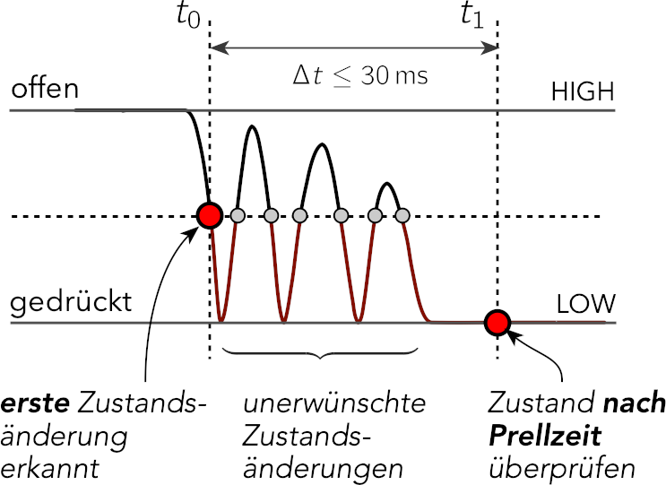

# **Tasterprellen (Bounce-Effekt)**
---
## **Bild zur Veranschaulichung**


---
## **Was ist Tasterprellen?**
Tasterprellen (engl. *Debouncing*) beschreibt das **ungewollte mehrfache Auslösen** eines mechanischen Tasters durch **Kontaktprellen** (kurzzeitiges Öffnen/Schließen der Kontakte beim Drücken oder Loslassen).

- **Ursache**:
  - Mechanische Kontakte (z. B. in Tastern) **prellen** beim Betätigen: Die Kontakte schließen/öffnen sich **mehrfach in Millisekunden**, dergrund ist einfach Physik.
  - Beispiel: Ein Taster sendet beim Drücken **mehrere Signale** (z. B. 1-0-1-0-1) statt nur **einem stabilen Signal** (1).
---

---
## **Problem: Falsche Detektion**
Ohne Gegenmaßnahmen führt Tasterprellen zu:
- **Falsche Ereigniserkennung** (z. B. Taster wird als "mehrfach gedrückt" interpretiert).
- **Ungewollte Reaktionen** des Systems (z. B. Airbag löst mehrmals aus, Motor startet/stoppt unkontrolliert).

**Beispiel**:
- Ein Taster soll eine LED einschalten. Durch Prellen wird fälschlicherweise **LED ein → aus → ein** geschaltet.
---

---
## **Lösungsansätze**

### 1. **Hardware-Lösung: Entprell-Schaltung (RC-Glied)**
- **Prinzip**: Kondensator + Widerstand glätten das Signal.
- **Vorteil**: Keine Software nötig.
- **Nachteil**: Zusätzliche Hardware-Komponenten.

---
### 2. **Software-Lösung: Delay-Methode**
- **Prinzip**: Nach einer Flanke (z. B. Taster gedrückt) **kurz warten** (z. B. 20–50 ms), bis das Signal stabil ist.
- **Implementierung in NNXT/C**:
  ```c
  void TasterTask() {
    static uint8_t lastState = 0;
    uint8_t currentState = TouchClicked(Port_0); // Taster abfragen

    if (currentState != lastState) {
      Delay(30); // Warte 30 ms (Entprell-Zeit)
      currentState = TouchClicked(Port_0); // Erneute Abfrage
      if (currentState == 1) {
        // Taster wirklich gedrückt
        NNXT_LCD_DisplayStringAtLine(0, "Taster gedrueckt");
      }
    }
    lastState = currentState;
  }
